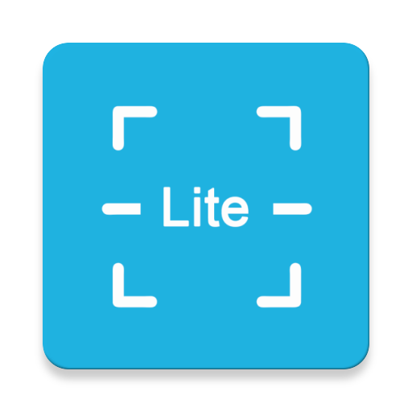

# ZXingLite



[](https://raw.githubusercontent.com/jenly1314/ZXingLite/master/app/release/app-release.apk)
[](https://jitpack.io/#jenly1314/ZXingLite)
[](https://travis-ci.org/jenly1314/ZXingLite)
[](https://android-arsenal.com/api?level=16)
[](http://www.apache.org/licenses/LICENSE-2.0)
[](http://blog.csdn.net/jenly121)
[](http://shang.qq.com/wpa/qunwpa?idkey=8fcc6a2f88552ea44b1411582c94fd124f7bb3ec227e2a400dbbfaad3dc2f5ad)

ZXingLite for Android 是ZXing的精简版，基于ZXing库优化扫码和生成二维码/条形码功能，扫码界面完全支持自定义，也可一行代码使用默认实现的扫码功能。总之你想要的都在这里。
>简单如斯，你不试试？ Come on~

## Gif 展示


## ViewfinderView属性说明
| 属性 | 值类型 | 默认值 | 说明 |
| :------| :------ | :------ | :------ |
| maskColor | color |<font color=#000000>#60000000</font>| 扫描区外遮罩的颜色 |
| frameColor | color |<font color=#1FB3E2>#7F1FB3E2</font>| 扫描区边框的颜色 |
| cornerColor | color |<font color=#1FB3E2>#FF1FB3E2</font>| 扫描区边角的颜色 |
| laserColor | color |<font color=#1FB3E2>#FF1FB3E2</font>| 扫描区激光线的颜色 |
| resultPointColor | color |<font color=#EFBD21>#C0EFBD21</font>| 扫描区结果点的颜色 |
| labelText | string |  | 扫描提示文本信息 |
| labelTextColor | color |<font color=#C0C0C0>#FFC0C0C0</font>| 提示文本字体颜色 |
| labelTextSize | dimension |14sp| 提示文本字体大小 |
| labelTextPadding | dimension |24dp| 提示文本距离扫描区的间距 |
| labelTextLocation | enum |bottom| 提示文本显示位置 |
| showResultPoint | boolean | false | 是否显示合适的扫码结果点 |
| frameWidth | dimension |  | 扫码框宽度 |
| frameHeight | dimension |  | 扫码框高度 |
| laserStyle | enum | line | 扫描激光的样式 |
| gridColumn | integer | 20 | 网格扫描激光列数 |
| gridHeight | integer | 40dp | 网格扫描激光高度，为0dp时，表示动态铺满 |


## 引入

### Maven：
```maven
<dependency>
  <groupId>com.king.zxing</groupId>
  <artifactId>zxing-lite</artifactId>
  <version>1.1.1</version>
  <type>pom</type>
</dependency>
```
### Gradle:
```gradle
implementation 'com.king.zxing:zxing-lite:1.1.1'
```
### Lvy:
```lvy
<dependency org='com.king.zxing' name='zxing-lite' rev='1.1.1'>
  <artifact name='$AID' ext='pom'></artifact>
</dependency>
```

###### 如果Gradle出现compile失败的情况，可以在Project的build.gradle里面添加如下：（也可以使用上面的GitPack来complie）
```gradle
allprojects {
    repositories {
        maven { url 'https://dl.bintray.com/jenly/maven' }
    }
}
```

## 引入的库：
```gradle
compileOnly 'com.android.support:appcompat-v7:28.0.0'
api 'com.google.zxing:core:3.3.3'
```

## 示例

布局示例 （可自定义布局，布局内至少要保证有SurfaceView和ViewfinderView，控件id可根据重写CaptureActivity 的 getPreviewViewId 和 getViewFinderViewId方法自定义）
```Xml
    <FrameLayout xmlns:android="http://schemas.android.com/apk/res/android"
        android:layout_width="match_parent"
        android:layout_height="match_parent">

        <SurfaceView
            android:id="@+id/surfaceView"
            android:layout_width="match_parent"
            android:layout_height="match_parent"/>
        <com.king.zxing.ViewfinderView
            android:id="@+id/viewfinderView"
            android:layout_width="match_parent"
            android:layout_height="match_parent"/>

    </FrameLayout>
```

代码示例 （二维码/条形码）
```Java
    //跳转的默认扫码界面
    startActivityForResult(new Intent(context,CaptureActivity.class),requestCode);

    //生成二维码
    CodeUtils.createQRCode(content,600,logo);
    //生成条形码
    CodeUtils.createBarCode(content, BarcodeFormat.CODE_128,800,200);
```

如果直接使用CaptureActivity需在您项目的AndroidManifest中添加如下配置
```Xml
    <activity
        android:name="com.king.zxing.CaptureActivity"
        android:screenOrientation="portrait"/>
```

### 快速实现扫码有以下几种方式：

> 1、直接使用CaptureActivity或者CaptureFragment。(纯洁的扫码，无任何添加剂)

> 2、通过继承CaptureActivity或者CaptureFragment并自定义布局。（适用于大多场景，并无需关心扫码相关逻辑）

> 3、在你项目的Activity或者Fragment中创建创建一个CaptureHelper并在相应的生命周期中调用CaptureHelper的周期。（适用于想在扫码界面写交互逻辑，又因为项目架构或其它原因，无法直接或间接继承CaptureActivity或CaptureFragment时使用）

> 4、参照CaptureHelper写一个自定义的扫码帮助类，其它步骤同方式3。（扩展高级用法，谨慎使用）


更多使用详情，请查看[app](app)中的源码使用示例

## 版本记录

#### v1.1.1：2019-5-20
*  支持扫二维码过小时，自动缩放
*  支持垂直条形码识别（增强条形码识别，默认不支持，需CaptureHelper.supportVerticalCode(true)开启）

#### v1.1.0：2019-4-19
*  将扫码相关逻辑与界面分离，ZXingLite使用更容易扩展
*  新增CaptureFragment

#### v1.0.7：2019-4-9
*  新增网格样式的扫描激光（类似支付宝扫码样式）
*  升级Gradle至v4.6

#### v1.0.6：2019-1-16
*  支持连续扫码
*  支持横屏扫码(主要为了支持Pad)

#### v1.0.5：2018-12-29
*  支持自定义扫码框宽高

#### v1.0.4：2018-12-19
*  修改text相关自定义属性，如：text->labelText

#### v1.0.3：2018-11-20
*  支持触摸缩放变焦

#### v1.0.2：2018-9-12
*  支持条形码下方显示显示code
*  优化相机预览尺寸遍历策略，从而降低预览变形的可能性

#### v1.0.1：2018-8-23
*  优化扫码识别速度

#### v1.0.0：2018-8-9
*  ZXingLite初始版本

## 赞赏
如果您喜欢ZXingLite，或感觉ZXingLite帮助到了您，可以点右上角“Star”支持一下，您的支持就是我的动力，谢谢 :smiley:<p>
您也可以扫描下面的二维码，请作者喝杯咖啡 :coffee:
    <div>
        
        
        
        
    </div>

## 关于我
   Name: <a title="关于作者" href="https://about.me/jenly1314" target="_blank">Jenly</a>

   Email: <a title="欢迎邮件与我交流" href="mailto:jenly1314@gmail.com" target="_blank">jenly1314#gmail.com</a> / <a title="给我发邮件" href="mailto:jenly1314@vip.qq.com" target="_blank">jenly1314#vip.qq.com</a>

   CSDN: <a title="CSDN博客" href="http://blog.csdn.net/jenly121" target="_blank">jenly121</a>

   Github: <a title="Github开源项目" href="https://github.com/jenly1314" target="_blank">jenly1314</a>

   加入QQ群: <a title="点击加入QQ群" href="http://shang.qq.com/wpa/qunwpa?idkey=8fcc6a2f88552ea44b1411582c94fd124f7bb3ec227e2a400dbbfaad3dc2f5ad" target="_blank">20867961</a>
   <div>
       
       
   </div>


   
